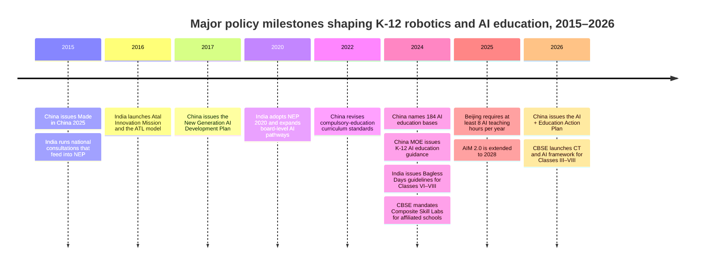

# Akil Robotics Training Plan

# K-12 Robotics Training in China and India in 2026

## Executive summary

As of April 2026, China and India are both expanding K-12 robotics training, but they are doing so through very different governance models. China’s system is increasingly state-orchestrated and folded into a broader **AI-in-education** strategy: the policy arc runs from **Made in China 2025** and the **2017 New Generation Artificial Intelligence Development Plan** to the **2024 Ministry of Education guidance on AI education in primary and secondary schools**, the rollout of **184 national AI education bases**, major municipal plans such as **Beijing’s 2025–2027 AI education plan**, and the new **2026 “AI + Education” Action Plan** jointly issued by five national agencies. India’s landscape is more federal, heterogeneous, and programmatic: it is shaped by **NEP 2020**, the **Atal Innovation Mission and Atal Tinkering Labs**, **CBSE’s AI and skill-education tracks**, new **Composite Skill Lab** requirements, and state-level public-school programs such as **Kerala’s robotics-in-Class-10** rollout and **Tamil Nadu’s TN SPARK** pilot. citeturn46search0turn2search2turn27search1turn27search2turn40search1turn41search1turn44search2turn5search0turn43search0turn29search0turn29search3

The practical consequence is that **China is ahead in formal curricular integration and AI framing**, while **India is stronger in mission-mode tinkering ecosystems and competition-led adoption**. In China, the official progression is now explicit: lower-primary students should *perceive and experience* AI, upper-primary and junior-secondary students should *understand and apply* it, and upper-secondary students should move toward *project creation and frontier applications*. In India, the most visible national entry points remain middle-school and secondary pathways: NEP 2020 pushes experiential and skill learning from around Grade 6 onward, CBSE has launched a **Computational Thinking and AI framework for Classes III–VIII** for session 2026–27, while its established AI skill subjects for Classes IX–XII carry formal marks, practical work, project work, and viva components. citeturn27search1turn40search1turn50search4turn6search12turn50search0turn50search11turn45search2

The private-sector ecosystems also diverge. China’s school and after-school market is anchored by **domestic integrated ecosystems** such as **Makeblock**, **Codemao**, **XiaoMaWang**, **Tongcheng Tongmei**, **UBTECH**, and **DJI RoboMaster**, with strong alignment to coding, AI, and national competition pipelines. India, by contrast, is more **open-stack and integrator-led**: **Arduino- and ESP32-style physical computing**, **LEGO Education**, **STEMpedia**, **Avishkaar**, and school-service firms such as **RoboGenius**, **TinkerBots**, and **ScienceUtsav** are highly visible. Publicly available, audited K-12 hardware market shares are scarce in both countries, so the most defensible 2026 comparison relies on visible proxies such as school reach, center networks, board alignment, and competition presence rather than precise vendor share percentages. Commercial forecasters nonetheless show fast growth in both national educational-robot markets. citeturn30search3turn30search1turn30search2turn48search3turn15search2turn16search0turn35search2turn16search1turn16search2turn49search1turn11search4turn49search16turn17search0turn17search1turn17search6

Accessibility remains the sharpest contrast. China has broader national digital infrastructure and resource-sharing platforms for basic education, and policy now explicitly calls for **urban-rural pairing, teacher training, and support for rural and remote schools**; yet academic evidence still finds significant urban-rural gaps in teachers’ digital competence, access, and professional development. India has built a large public innovation network through **10,000+ Atal Tinkering Labs**, but infrastructure remains a structural constraint: official UDISE+ results for 2024–25 report **64.7% of schools with computers** and **63.5% with internet access**, while government schools still form the backbone of the system at **69% of institutions**. The result is a two-speed market in India: elite private and well-funded urban public schools can support competition-grade robotics and AI projects, while many rural and government schools access robotics only through targeted labs, NGOs, state pilots, district science centers, or time-bound grant programs. citeturn26search2turn27search1turn18search1turn26search3turn18search5turn5search0turn5search6turn25search3turn51search4turn51search10turn11search3turn29search0turn29search3

## Policy and governance

China’s K-12 robotics-training environment is now best understood as part of a broader **AI, digital education, and science-education** strategy rather than as a standalone “robotics education” policy silo. The industrial backdrop was **Made in China 2025**, which identified **robotics** among the strategic fields for national upgrading. The education-specific shift came with the **2017 New Generation AI Development Plan**, which made AI talent cultivation a national priority. That broad strategy has since been translated into school policy through the **2022 compulsory-education curriculum revision**, the **2024 list of 184 national AI education bases**, the **December 2024 MOE notice strengthening AI education in primary and secondary schools**, and the **April 2026 “AI + Education” Action Plan**, which further integrates AI into teaching, learning, and educational management. In other words, robotics in China is increasingly justified through a state narrative of **AI literacy, digital competence, scientific innovation, and talent pipelines**. citeturn46search0turn2search2turn27search2turn27search1turn41search1turn41search2

India’s policy framework is less centralized but still substantial. **NEP 2020** established the larger logic for technology-enabled, multidisciplinary, and experiential schooling; it also elevated vocational exposure, maker-oriented learning, and flexible skill pathways in the middle years. The strongest school-facing public instrument has been the **Atal Innovation Mission**, whose **Atal Tinkering Labs** became the country’s most visible public infrastructure for school-level robotics, electronics, and design innovation. CBSE has gradually layered a more formal curricular structure on top of that ecosystem through **AI skill subjects**, the **2026–27 launch of the CT&AI framework for Classes III–VIII**, and the creation of **Composite Skill Labs** in affiliated schools. State governments then add a third layer: Kerala has mainstreamed robotics into public-school ICT learning, while Tamil Nadu is piloting AI/robotics learning at scale in government schools through TN SPARK. citeturn44search2turn5search0turn46search10turn50search4turn43search0turn43search3turn29search0turn29search3

A major structural difference is how the after-school market is regulated. China’s **2021 “double reduction” policy** sharply restricted subject-based K-12 tutoring, and the **2025 national training-regulation platform rules** strengthened oversight further. A reasonable interpretation of the post-2021 market is that robotics, programming, maker education, and AI have become more prominent as **“quality education”** or school-service offerings rather than exam-coaching products; leading providers now foreground school partnerships, after-school service projects, innovation centers, and competitions. India has no equivalent national restriction on private enrichment, so its after-school robotics sector remains more commercially plural and competition-oriented. citeturn42search1turn42search2turn30search1turn48search2turn49search1

The milestones above are drawn from official Chinese and Indian policy sources and show the core contrast clearly: **China’s timeline is AI-system-building from the top down**, while **India’s is innovation-mission and board/state implementation from multiple centers of authority**. citeturn46search0turn44search11turn5search6turn2search2turn44search2turn27search2turn27search1turn45search2turn43search0turn40search1turn46search10turn41search1turn50search4

## Private-sector ecosystem and hardware

Open-source, audited **market-share** data for K-12 robotics vendors are limited in both countries. What is available publicly is mostly (a) company-reported reach metrics, (b) center counts, (c) board alignment, (d) competition visibility, and (e) broad market-size forecasts from industry firms. These forecasts point to rapid growth in both countries’ educational-robot markets, but they do **not** cleanly map to K-12 classroom share, and they should therefore be treated as directional rather than definitive for school adoption. citeturn17search0turn17search1turn17search6

### Provider and hardware comparison

| Country | Provider or stack | Public visibility proxy | Typical hardware and software used in K-12 | Analytical take |
|---|---|---|---|---|
| China | **Codemao** | UNESCO described Codemao as **China’s largest online coding teaching platform for children**; its official site emphasizes school services, offline innovation centers, and AI-enabled creation tools. citeturn30search3turn30search1 | Graphical coding, Python, C++, AI drawing, face/gesture recognition, school AI-programming services. citeturn30search1 | Strong software-and-content layer; especially important in school service and mass AI literacy. |
| China | **XiaoMaWang** | Officially targets ages **6–16** and offers offline small-group, live, and interactive AI classes. citeturn30search2turn15search1 | Scratch, Python, C/C++, Olympiad-oriented coding tracks. citeturn30search2 | More competition-oriented than pure robotics; influential in the private enrichment lane. |
| China | **Tongcheng Tongmei** | Official site says it has **230+ growth centers in 50+ cities**. citeturn48search3 | Scratch, Python, C++, robot programming, innovation camps, olympiad prep. citeturn48search2turn48search3 | One of the clearest examples of a national offline chain still active after tutoring-market restructuring. |
| China | **Makeblock** | The company’s education business is explicitly K-12 focused; mBlock is free and mBot2 is its flagship entry robot. citeturn15search2turn33search0turn35search0 | mBot2, mBlock, block-based coding, Python, AI/IoT extensions, classroom robot kits. citeturn35search0turn33search0 | Likely the most visible domestic school-hardware ecosystem in entry-to-intermediate robotics. |
| China | **UBTECH Education** | Official education products cover elementary through advanced levels, from uKit AI to Yanshee. citeturn16search0turn16search11turn34search2 | uKit AI for Grades 3–5, Yanshee humanoid platform for senior high+, AI perception, Blockly and text coding. citeturn16search11turn34search2 | Strong in higher-end classroom AI robotics and humanoid pathways. |
| China | **DJI RoboMaster / Tello EDU** | DJI’s RoboMaster TT remains visible in education and competition channels, though the mainland official store page notes it is no longer sold online there. citeturn34search1turn35search2 | Programmable drones and competition robots, coding through education/competition workflows. citeturn34search1turn35search2 | Important in advanced clubs, drone robotics, and competition prep rather than mass beginner adoption. |
| China | **DFRobot** | Strong maker-positioning with micro:bit and sensor kits, plus explicit K-12 and maker learning resources. citeturn34search3turn35search5 | Boson, micro:bit, MakeCode, Scratch-like Mind+, modular sensors and actuators. citeturn35search5turn36view2 | Especially relevant for low- to mid-cost home and club tinkering. |
| India | **STEMpedia** | Officially sells AI/robotics labs, CBSE- and ICSE-aligned offerings, Quarky kits, PictoBlox software, and teacher bootcamps. citeturn16search1turn16search6turn31search5 | Quarky, PictoBlox, blocks + Python, AI/ML projects, IoT, self-driving car and gesture-control projects. citeturn16search6turn31search9turn31search11 | One of India’s strongest integrated curriculum-plus-hardware stacks for schools. |
| India | **Avishkaar** | Company-reported scale of **300,000+ innovators**, **6,000+ schools**, **30+ countries**. citeturn16search2turn32search0 | Maker Board, MEX kits, robotics starter/advanced kits, AI/IoT projects, online classes and labs. citeturn32search0turn32search5turn32search7turn32search9 | A major domestic hardware and lab brand, especially for school partnerships and home kits. |
| India | **LEGO Education ecosystem** | Visible via FLL India, India STEM Foundation offerings, and school resellers such as RoboGenius. citeturn20search2turn11search7turn49search1 | SPIKE Prime, Scratch-based coding, structured challenge kits for middle-school robotics. citeturn11search7turn11search11 | Especially strong in private schools and competition pipelines rather than universal public-school access. |
| India | **Arduino / ESP32 open stack** | Seen in state public-school initiatives and Indian providers’ hardware choices. Kerala’s official robotics rollout explicitly uses Arduino breadboards; many Indian vendors emphasize open-source boards and ESP32-class controllers. citeturn29search0turn32search8turn37search8 | Arduino-compatible boards, ESP32 cars, sensors, breadboards, block coding plus Python/C. citeturn29search0turn32search8turn37search8 | This is arguably the defining Indian hardware pattern because it keeps costs lower and encourages repair/tinkering. |
| India | **School-service integrators** | Firms such as RoboGenius, TinkerBots, and ScienceUtsav package labs, curriculum, and teacher support for schools. citeturn49search1turn11search4turn49search16 | LEGO Education, coding-and-AI labs, robotics clubs, school transformation programs. citeturn49search1turn11search4turn49search16 | Important channel partners in private schools and better-funded urban contexts. |

The most important hardware contrast is qualitative, not merely brand-level. China’s K-12 robotics stack is increasingly built around **integrated domestic ecosystems** that unite hardware, coding environments, curriculum, and competitions under a coherent AI narrative. India’s stack is more **modular and price-sensitive**: LEGO remains important, but large parts of the market are driven by **open microcontroller architectures**, classroom packs, and local startups that layer software, curriculum, and competition coaching on top. That makes India more flexible, but also more uneven in quality and support. citeturn35search0turn16search11turn34search2turn16search6turn16search2turn29search0turn49search1

## Curriculum depth by school level

The curriculum question is where the China–India difference is most visible. China now has an official school-stage progression for **AI education** and folds robotics into a wider package of information technology, science, labor, and project-based learning. India has moved decisively toward formalization as well, but the pathway is still more layered: **CT&AI in the lower and middle grades**, **AI as a skill subject in the secondary and senior-secondary grades**, **maker/lab exposure through ATL and skill labs**, and stronger state-level experimentation in a handful of systems such as Kerala and Tamil Nadu. citeturn27search1turn40search1turn50search4turn50search0turn50search11turn29search0turn29search3

### Curriculum depth comparison

| Country and level | What is formally emphasized | Typical coding languages and tools used in practice | AI and ML content | Hardware engineering depth | Assessment pattern |
|---|---|---|---|---|---|
| **China primary** | MOE guidance says lower primary should focus on **sensing and experiencing AI**, while upper primary moves toward **understanding and application**. Beijing describes primary-stage AI as **experience-based** and centered on awakening AI thinking. citeturn27search1turn40search1 | Usually graphical/block coding in school and academy environments, often through mBlock-, Scratch-, or Kitten-like tools. citeturn33search0turn30search1turn35search0 | Basic perception of AI, simple recognition functions, human-machine interaction, everyday uses, ethics awareness at a light level. citeturn27search1turn30search1 | Beginner robot assembly, sensors, motors, line following, simple actuators, structured kits rather than open-ended fabrication. citeturn35search0turn16search11 | Official guidance stresses **regular teaching and evaluation** through task-, project-, and problem-based learning rather than a single national robotics exam. citeturn27search1turn40search1 |
| **China secondary** | MOE guidance raises expectations from **application** in junior secondary to **project creation and frontier applications** in senior high; Beijing adds AI universals for all students with at least **8 teaching hours per year** in compulsory schooling. citeturn27search1turn40search1turn28search0 | Python becomes much more common; competition lanes also pull many students into C/C++ or Olympiad-style coding. Advanced school platforms include Blockly plus Python/C/C++/Java. citeturn30search2turn34search2turn48search3 | Model usage, computer vision, speech, data use, AI-assisted learning tools, ethics, and project design become more explicit. citeturn40search1turn27search1 | More open-ended hardware work: autonomous cars, drones, humanoid platforms, multiple sensors, edge devices, and competition-grade builds. citeturn34search1turn34search2turn35search2 | More performance- and project-based, often tied to school innovation tasks and competitions; formalization varies by locality. citeturn40search1 |
| **India primary and middle** | CBSE’s 2026–27 **CT&AI framework for Classes III–VIII** pushes foundational computational thinking and AI exposure; NEP-linked **Bagless Days** reinforce skill exploration in Grades 6–8. citeturn50search4turn6search12turn45search2 | Mostly blocks and simplified visual environments in lower grades, with gradual transitions to richer coding tasks. STEMpedia’s classwise school curriculum also mirrors this progression. citeturn31search0turn31search4 | The CBSE framework explicitly references computing systems, networks, the internet, AI, and social impacts; AI is more conceptually introduced than mathematically formalized at this level. citeturn6search12turn50search4 | Tinkering, simple electronics, beginner robots, and maker tasks in ATL or school labs; public-school exposure is often episodic unless a state scheme exists. citeturn5search0turn29search3 | Mostly formative and school-level; robotics is usually embedded in activities, modules, or lab work rather than a universal external exam. citeturn45search2turn43search0 |
| **India secondary and senior secondary** | CBSE AI skill subjects for Classes IX–XII are now a mature formal track. Class IX AI carries **100 marks (50 theory + 50 practical)**; Class XI introduces **Python**, **capstone projects**, **data literacy**, **ML algorithms**, **linguistics/NLP links**, and **AI ethics**. citeturn50search0turn50search1turn50search11turn50search7 | Python is central; schools also use blocks-to-Python transitions, PictoBlox, LEGO coding, Arduino-style stacks, and competition scripts. citeturn50search1turn16search6turn11search7turn29search0 | Considerably deeper than in primary: AI project cycle, bias, access, SDGs, data analysis, model types, practical AI applications, and industry certifications. citeturn50search8turn50search11 | More serious physical computing and automation: Arduino/ESP32, sensors, self-driving demos, gesture control, rover-style systems, and state-issued public-school kits in Kerala. citeturn29search0turn31search9turn31search11 | CBSE’s senior-secondary AI curriculum includes **practical file**, **written practical exam**, **viva voce**, **capstone/internship**, and even optional industry certification evidence. citeturn50search11 |

Two analytical points follow from this comparison. First, **China’s robotics training is being institutionalized through AI literacy and structured stage descriptors**, which makes it easier for provincial and municipal systems to standardize expectations. Second, **India’s strongest formal depth currently appears from Class IX upward**, where CBSE’s AI subjects become explicit, graded, and assessable; below that level, access still depends heavily on whether a school has ATL infrastructure, private vendor support, or a proactive state initiative. citeturn27search1turn40search1turn50search0turn50search11turn5search0turn29search3

## Competition pathways

In both countries, competitions do more than motivate students: they also shape **curriculum depth, kit choices, coaching markets, school branding, and teacher professional development**. What differs is how tightly competition is tied to the formal system. In China, participation is increasingly filtered through **approved national competition lists** and public-school legitimacy concerns. In India, competitions are more openly pluralistic and often double as access pathways into robotics for schools that do not yet have a fully embedded curriculum. citeturn22search1turn20search2turn24search11turn20search3

### Major competition comparison

| Country | Event | Age brackets | Scale and status | Entry pathway | Hardware implications |
|---|---|---|---|---|---|
| **China** | **World Robot Contest Youth Robot Design Contest** | Primary and secondary students; multiple school-age categories | Officially identified as a national competition for primary and secondary students in the MOE-approved list for 2022–2025, and the broader national competition-list regime continued for 2025–2028. citeturn21search0turn22search1 | School clubs, regional qualifiers, approved national competition channels. | Encourages structured design, teamwork, and school-recognized robotics pathways. |
| **China** | **WRO China** | Elementary **8–12**, Junior **11–15**, Senior **14–19** in the main tracks. citeturn23search0turn20search0 | China’s 2025 invitational gathered **nearly 1,000 young participants**, and the national final planned recruitment of **200+ teams**. citeturn23search5turn23search0 | Invite/regional events, points systems, and national finals feeding international representation. citeturn23search0turn23search2 | Since 2025, **RoboMission** rules became **open to all hardware platforms**, reducing single-vendor lock-in. citeturn20search4 |
| **China** | **FIRST LEGO League Greater China / Asia circuit** | Global FLL spans approximately **ages 5–16**, depending on division and country. citeturn47search1turn20search9 | The 2025 FLL Asia Championship in Macau drew **400 teams**, **3,000+ youth**, and delegations from **21 countries and regions**. citeturn47search2 | School teams advance through local/regional partner structures into regional or Asia events. | Keeps **LEGO Education** highly visible in premium and international-school segments. |
| **India** | **WRO India** | Official site describes students **8–22** across categories. citeturn24search11 | Organized by India STEM Foundation with NCSM support; national structure runs **L1 Virtual**, **L2 Regional**, **L3 National**, **L4 International**. citeturn24search11turn24search3 | Teams register through WRO India; each school can claim **one free Future Innovators team**. citeturn24search6turn24search2 | Strong driver of school robotics clubs; relatively inclusive due free-entry option in one category. |
| **India** | **FIRST LEGO League India** | FLL globally serves youth **5–16**; India runs regional and national levels. citeturn47search1turn20search2 | India STEM Foundation says FLL India, launched in **2009**, has seen **1,000+ teams** over time and impacts several thousand students annually. citeturn20search2 | Regional tournaments in multiple cities feed national events. citeturn20search2 | Strongly tied to **LEGO SPIKE**-style competitive preparation, especially in private schools. |
| **India** | **TechnoXian** | Junior challenges commonly **8–16**; open categories also exist. citeturn24search0turn24search15 | Official site markets **15+ skill-based challenge categories** and a national-to-world-championship format; 2026 national round is scheduled for **October 23–25, 2026**. citeturn24search4turn20search3 | Registration can happen through a RoboClub, school, or institute; multiple challenge tracks. citeturn24search0turn24search15 | Favors diverse custom builds and is especially important in India’s coaching-academy ecosystem. |

Competitions in China tend to reinforce **institutional legitimacy, AI-policy alignment, and recognized talent pathways**, whereas in India they also serve as a **market-creation mechanism**: schools often buy labs or coaching precisely in order to enter WRO, FLL, or TechnoXian. This helps diffusion, but it also means the quality of robotics learning can depend heavily on coaching intensity and family or school spending. citeturn22search1turn24search11turn20search2turn20search3

## Accessibility and equity

China has the stronger national digital backbone for equalizing access, at least at the level of **content distribution and policy intent**. The Ministry of Education’s **Smart Education of China** platform was explicitly extended for comprehensive use in primary and secondary schools in 2024 to promote broader access to high-quality basic-education resources and more balanced regional development, and by 2025 the platform had grown to **164 million registered users**. The 2024 MOE AI-education notice also explicitly told local systems to support **rural and remote schools**, promote **teacher mobility**, and use networked platforms to connect urban and rural schools. Yet academic evidence remains clear that access parity has not eliminated capability gaps: recent studies find measurable urban-rural divides in teachers’ **TPACK**, **digital environments**, **professional development**, and **ICT competence**, even as AI-assisted teaching pilots show promise for improving learning outcomes in rural schools. citeturn26search2turn26search14turn27search1turn18search1turn26search3turn18search5

India’s access picture is more uneven because a national tinkering-lab strategy is operating inside a school system that still has incomplete digital infrastructure. Official UDISE+ 2024–25 findings report **64.7% of schools with computers** and **63.5% with internet access**, while PIB summaries of the Indian school system show that **government schools account for 69% of institutions** and about half of students. On the positive side, AIM reports that the ATL network has reached **10,000+ schools**, **75 lakh+ students**, **6,200+ mentors**, **35 states and UTs**, and **722 districts**, with **more than 60%** of labs in government and government-aided schools and **about half** in Tier 2/3 cities and rural India. That means India’s public system does have a large innovation-access mechanism, but it is still a **lab-network model**, not yet a uniformly embedded robotics curriculum across the country. citeturn25search3turn51search4turn51search10turn5search0turn5search6

### Accessibility comparison

| Dimension | China | India |
|---|---|---|
| **Availability in elite urban schools** | Often includes dedicated maker/AI labs, city-level AI mandates or local curriculum support, university-company partnerships, and strong competition coaching. Beijing’s 2025–2027 plan is the clearest example. citeturn40search1turn28search0 | Typically strongest in CBSE/ICSE/international private schools, where vendor-installed labs, LEGO/FLL tracks, and specialist coaches are common. citeturn43search0turn49search1turn11search4 |
| **Availability in rural and public schools** | Increasingly supported through Smart Education of China, AI bases, school-pairing models, and county-school strengthening, but hardware access and teacher capacity remain uneven. citeturn26search2turn27search1turn26search7turn18search1 | Access frequently depends on ATL grants, public-school state schemes, science-center partnerships, or NGO-supported labs rather than universal provision. citeturn5search0turn11search3turn29search0turn29search3 |
| **Teacher capacity** | MOE guidance now requires teacher training, and Beijing is investing in seed teachers and lecturer corps; academic work still finds urban-rural teacher capability gaps. citeturn27search1turn40search1turn26search3 | ATL uses external mentors; CBSE is building skill-lab and teacher-capacity structures; teacher confidence and continuity remain a known constraint in public settings. citeturn5search0turn43search3turn19search3 |
| **Infrastructure dependence** | Stronger national platform support reduces content scarcity, but advanced robotics still requires local labs and devices. citeturn26search2turn26search15 | Official school ICT access is improving but still incomplete, making robotics access highly infrastructure-sensitive. citeturn25search3turn51search4 |
| **Equity programs** | Rural-support language is built directly into MOE AI policy and local school-pairing plans. citeturn27search1turn40search1 | ATL network, India STEM Foundation’s free robotics-lab support, Kerala’s public-school robotics rollout, and TN SPARK are the most visible equity mechanisms. citeturn5search6turn11search3turn29search0turn29search3 |

One striking point is that India has produced some unusually ambitious **public-school exemplars** even though the national baseline is uneven. Kerala’s government officially integrated robotics into the **Class 10 ICT curriculum** for roughly **4.3 lakh students**, and the first textbook activity uses familiar, low-cost components such as an **Arduino breadboard, IR sensor, and servo motor**. Tamil Nadu’s **TN SPARK** has also set an explicitly public-school target, aiming at **Classes 6–9 in 3,000 government schools with functional hi-tech labs**. These are significant because they show that India’s public-school robotics future may be driven by **state innovators** before it becomes uniformly national. citeturn29search0turn29search3

## 2026 directory of academies, platforms, access routes, and home kits

This directory prioritizes providers with a visible 2026 web presence, structured K-12 offerings, or credible school-service evidence. In both countries, many local studios exist beyond this list; the directory below focuses on actors that are large enough, public enough, or policy-linked enough to help an education-technology researcher map the landscape.

### After-school academies

| Country | Academy | City or coverage | Public contact and website pathway | Program focus |
|---|---|---|---|---|
| China | **Codemao innovation centers / school-service network** | Shenzhen HQ; national school-service and offline-center footprint | Official site; hotline **400-835-3800**; school-service and offline-center links on the main site. citeturn30search1 | Coding-to-AI pathway, campus services, AI creation tools, innovation-center learning. |
| China | **XiaoMaWang** | Hangzhou HQ; multi-city network | Official site; service hotline **4000-596-872**; email **service@xiaoma.cn**. citeturn30search2 | Scratch, Python, C/C++, AI programming, olympiad and competition-oriented pathways. |
| China | **Tongcheng Tongmei** | Beijing / national; **230+ centers in 50+ cities** | Official site and online site; hotline **400-690-6161**. citeturn48search3turn48search2 | Coding, AI programming, robotics, olympiad prep, camps and study tours. |
| China | **Young Coders Academy** | Beijing and Shanghai | Official site and admissions pages. citeturn12search0 | International-school partnerships, camps, coding and robotics pathways. |
| China | **Semia WRO training-bases ecosystem** | Beijing HQ; national WRO training footprint | Official site; main office **010-82252706**; email **service@semia.com**. citeturn23search3 | WRO-linked robotics learning, starter through advanced youth STEM pathways. |
| India | **RoboGenius** | Gurugram / Delhi NCR and school partnerships | Official academy and contact pages; **0124-4219876**, **9958590959**, **admin@robogenius.in**. citeturn49search1turn49search9 | STEM, robotics, coding, AI; also LEGO Education reseller and school-integrator role. |
| India | **Saras Robotics & Activity Center** | Pune | Official contact page; **+91 9850503209**, **sarasrobotics@gmail.com**. citeturn49search3turn49search15 | Progressive hands-on robotics curriculum, competition prep, school partnerships. |
| India | **JAY Robotics** | Chennai | Official website and inquiry form. citeturn11search9 | Robotics training and workshops; strong city-level visibility. |
| India | **iRobokid** | Mumbai | Official site and web inquiry. citeturn49search0 | Six programs for ages **6–14**, STEM/robotics classes for children. |
| India | **ScienceUtsav** | Offices in Bengaluru, Mumbai, Pune, and Mangalore | Official site and office-based inquiry route. citeturn49search16 | STEM labs, school robotics programs, science-plus-robotics services. |

### Online platforms and courses

| Country | Platform | Language availability | Public price model | Best use case |
|---|---|---|---|---|
| China | **Codemao Online** | Chinese | Freemium tools and app downloads; full course prices are not transparently listed on the public site. citeturn30search1turn33search1 | Mass entry into coding/AI creation and school-linked extension work. |
| China | **HeTao Coding** | Chinese | Official site advertises a **10.8 yuan** trial; full pathway pricing is largely inquiry- or purchase-flow based. citeturn33search3 | Online-first progression from beginner coding toward higher-level pathways. |
| China | **XiaoMaWang Online** | Chinese | Free trial / lesson booking plus paid live classes; public prices are limited. citeturn33search2turn33search6 | Families wanting synchronous instruction and competition-intensive progression. |
| China | **mBlock by Makeblock** | Chinese and English interfaces common in practice | **Free software**; paid hardware is separate. citeturn33search0 | Home learning with robotics kits and school-use continuity. |
| India | **STEMpedia Education / PictoBlox** | Primarily English; widely used in Indian schools | Public site offers **free beginner courses**; some teacher bootcamps are openly priced, e.g. **INR 5,000** for a robotics-and-AI educator bootcamp. citeturn31search0turn31search9 | Strong for school-aligned self-study, Python transition, and AI project work. |
| India | **Avishkaar Maker Studio** | English | Mix of free community access, kit-linked course unlocks, and paid classes or bundles. citeturn32search1turn32search3turn32search5 | Best for families buying Avishkaar kits and wanting an integrated online-plus-hardware path. |
| India | **Robokidz Online** | English / Indian-market delivery | Inquiry-based pricing on official site. citeturn49search8 | Beginner family-oriented online exposure. |
| India | **iRobokid / RoboGenius online pathways** | English | Inquiry-based pricing. citeturn49search0turn49search1 | City-anchored but online-capable entry to structured robotics learning. |

### School-based program access pathways

| Country and school type | Main access route in 2026 | What a parent or researcher should expect |
|---|---|---|
| **China public schools** | Information-technology/science/labor classes, AI sections on Smart Education of China, AI bases, after-school service, and approved competition channels. citeturn27search1turn26search2turn27search2turn22search1 | Access increasingly depends on province/city implementation quality; Beijing-like systems are ahead of county systems. |
| **China private and international schools** | School-built maker labs, international competitions such as FLL/WRO, and vendor partnerships with Makeblock/LEGO/UBTECH-type ecosystems. citeturn40search1turn47search2turn35search0turn34search2 | Typically deeper hardware access, more competitions, and more direct after-school coaching. |
| **India public schools** | ATL installation, state schemes such as Kerala and TN SPARK, district science centers, and NGOs such as India STEM Foundation. citeturn5search0turn29search0turn29search3turn11search3 | Access is often grant- or project-based; quality varies by state, school leadership, and teacher support. |
| **India private schools** | CBSE skill subjects, Composite Skill Labs, vendor-installed AI/robotics labs, and direct entry to WRO/FLL/TechnoXian. citeturn43search0turn43search3turn49search1turn20search2turn20search3 | Usually the most stable route to year-round robotics learning and competition prep. |

### Recommended DIY kits for home learning

Public consumer pricing is much easier to verify in India than in China, where classroom-kit pricing is often bundle- or reseller-dependent. The table below therefore separates **publicly visible list prices** from **quote-based education pricing**.

| Market | Kit or model | Publicly visible price | Age and level | Why it is a good fit | Where to buy |
|---|---|---:|---|---|---|
| China | **Makeblock mBot2** | Third-party public listings around **US$105–112** internationally; China marketplace pricing varies by seller and bundle. citeturn35search3turn35search0 | Roughly beginner to intermediate, often marketed for ages **5–16**. citeturn35search0 | Excellent bridge from block coding to Python, with strong classroom/home continuity. | Makeblock channels, JD/Tmall-style marketplaces, authorized resellers. citeturn35search1turn35search0 |
| China | **DFRobot Boson Starter Kit for micro:bit** | **US$69** on DFRobot’s official store. citeturn36view2 | **Age 10+**. citeturn36view2 | Low-cost modular sensor-and-actuator entry for physical computing and beginner robotics. | DFRobot official store and maker distributors. citeturn36view2 |
| China | **UBTECH Yanshee** | Public China-school pricing is not easily visible; an international reseller lists it at **US$2,199**, so this is a premium option. citeturn34search8turn34search2 | Senior high and above. citeturn34search2 | Suitable for advanced humanoid robotics, AI, and text-based programming. | UBTECH education sales or specialist resellers. citeturn34search2 |
| India | **Avishkaar MEX 5-in-1 Robotics Starter Kit** | **INR 2,499**. citeturn32search0 | **Age 8+**. citeturn32search0 | A strong low-cost first robotics kit with Indian curriculum and community support. | Avishkaar official shop. citeturn32search0 |
| India | **Avishkaar Maker Board** | **INR 2,149**. citeturn36view1 | **Age 10+**. citeturn36view1 | Best for coding, electronics, IoT, and open-ended projects before moving into larger robots. | Avishkaar official shop. citeturn36view1 |
| India | **Avishkaar Robotics Advanced Kit** | **INR 10,599**. citeturn32search9 | Older beginners to teens. citeturn32search9 | Better for sustained hardware-building depth and more serious robotics. | Avishkaar official shop. citeturn32search9 |
| India | **LEGO Education SPIKE Prime** | **INR 76,990** on Amazon India. citeturn11search11 | Middle school and competition-track learners. citeturn11search7 | Ideal for FLL-style structured robotics, but expensive for many homes. | Education resellers and major marketplaces. citeturn11search7turn11search11 |

The strongest home-learning recommendation for **cost-sensitive families** is different in each country. In China, the best value lies in **mid-cost domestic entry kits plus free software**; in India, it lies in **open-board or locally built kits from Avishkaar or STEMpedia-type ecosystems**, especially where school curricula or competitions use the same stack. LEGO remains the premium, competition-aligned choice in India, but it is not the equity-friendly default. citeturn33search0turn36view2turn16search6turn16search2turn11search11

## Data gaps and interpretation

The biggest factual gap in the open 2026 landscape is **vendor market share**. I did not locate reliable, open, audited K-12 robotics market-share tables for China or India. Commercial reports discuss leading companies and national market growth, but their detailed share matrices appear to remain behind paywalls or bundled client products. For that reason, this report treats **center counts, school counts, curriculum alignment, and competition presence** as better public proxies than hard share claims. The same caution applies to pricing: many school-lab packages in both countries are **quote-based**, and family-facing course fees—especially in China’s regulated after-school market—are often less transparent than in India. citeturn17search0turn17search1turn17search5turn17search7

A second gap is **subnational comparability**. China’s most advanced implementations are concentrated in richer cities and demonstration schools, while India’s strongest public-school robotics models currently sit in standout states and schemes rather than in uniform national coverage. That means the “China vs India” comparison is most valid at the level of **system design**: China is more centralized, AI-framed, and curriculum-led; India is more decentralized, lab-driven, and competition-mediated. The practical implication for researchers is that China’s future K-12 robotics story will likely be about **standardization and scale**, while India’s will likely be about **how fast fragmented excellence can become broad public provision**. citeturn40search1turn41search1turn5search0turn29search0turn29search3turn25search3turn18search1turn19search3

On balance, the 2026 landscape favors **China in systemic integration** and **India in plural innovation pathways**. China has the clearer top-down roadmap and a stronger domestic hardware-software ecosystem for school adoption. India has the more open, entrepreneurial, and competition-accessible ecosystem, with particularly strong local startups and public missions such as ATL, but still faces steeper infrastructure and teacher-capacity constraints. For educational-technology researchers, that makes the comparison especially valuable: the two countries are building robotics education toward similar STEM and AI goals, but they are doing so through fundamentally different institutional logics. citeturn27search1turn41search1turn30search3turn35search0turn5search6turn50search4turn25search3turn26search2

====

## Overview
This training plan outlines a comprehensive approach to implementing robotics education for K-12 students, inspired by successful models in China and India. The plan focuses on integrating robotics, AI, and computational thinking into school curricula, with emphasis on hands-on learning, progressive skill development, and accessibility.

## Objectives
- Develop computational thinking and problem-solving skills
- Introduce students to robotics, AI, and IoT technologies
- Foster creativity and innovation through project-based learning
- Ensure equitable access across different school types and regions
- Prepare students for future careers in STEM fields

## Target Audience
- Primary school students (ages 6-12): Focus on experiential learning and basic concepts
- Secondary school students (ages 13-18): Advanced programming, AI applications, and project development

## Curriculum Structure

### Primary Level (Grades 1-5)
- **Hands-on Experience**: Introduction to basic robotics concepts through play and simple assemblies
- **Block-based Programming**: Use visual programming languages to control robots
- **Basic Electronics**: Understanding sensors, motors, and simple circuits
- **Duration**: 4-8 hours per academic year

### Middle Level (Grades 6-8)
- **Computational Thinking**: Logic, algorithms, and problem decomposition
- **Python Programming**: Transition from block-based to text-based coding
- **IoT and Sensors**: Integrating hardware with software for real-world applications
- **Project Work**: Small group projects and prototyping
- **Duration**: 8-12 hours per academic year

### Secondary Level (Grades 9-12)
- **Advanced Programming**: Python, C/C++, Java for complex robotics
- **AI and Machine Learning**: Computer vision, natural language processing
- **Robotics Engineering**: Design, build, and test autonomous systems
- **Innovation Projects**: Large-scale projects with real-world applications
- **Duration**: 12-16 hours per academic year

## Hardware and Resources

### Recommended Kits
- Beginner: mBot or similar wheeled robots for block-based programming
- Intermediate: Arduino-compatible platforms with sensors and actuators
- Advanced: DJI RoboMaster or humanoid robots for complex projects

### Software Tools
- Visual Programming: Scratch, Blockly
- Text-based: Python, Arduino IDE
- AI Tools: Pre-trained models, computer vision libraries
- Simulation: Robotics simulation software for testing

## Implementation Strategy

### Phase 1: Pilot Program (6 months)
- Select 5-10 schools for initial implementation
- Train teachers and provide initial hardware
- Develop curriculum materials and assessment tools
- Monitor progress and gather feedback

### Phase 2: Expansion (1-2 years)
- Scale to additional schools and regions
- Establish partnerships with local governments and organizations
- Create online resources and teacher training programs
- Integrate with national education standards

### Phase 3: Sustainability (Ongoing)
- Develop certification programs for teachers
- Create competition platforms and events
- Establish maintenance and support systems
- Continuously update curriculum based on technology advancements

## Teacher Training
- **Initial Training**: 40-60 hours of professional development
- **Ongoing Support**: Workshops, online resources, and peer mentoring
- **Specialization**: AI literacy, robotics engineering, and pedagogy

## Assessment and Evaluation
- **Formative Assessment**: Regular quizzes, project check-ins
- **Summative Assessment**: End-of-year projects and presentations
- **Student Feedback**: Surveys and focus groups
- **Program Metrics**: Participation rates, skill development, and engagement

## Challenges and Solutions

### Accessibility
- **Challenge**: Urban-rural divide in resources and expertise
- **Solution**: Online platforms, mobile labs, and teacher exchange programs

### Teacher Capacity
- **Challenge**: Limited robotics expertise among educators
- **Solution**: Comprehensive training programs and partnerships with universities

### Funding
- **Challenge**: High initial costs for hardware and training
- **Solution**: Government grants, private partnerships, and phased implementation

## Partnerships
- Collaborate with technology companies for hardware donations
- Partner with universities for teacher training and research
- Engage with international organizations for best practices and competitions

## Timeline
- **Month 1-3**: Planning and resource acquisition
- **Month 4-6**: Teacher training and pilot launch
- **Month 7-12**: Program evaluation and adjustments
- **Year 2**: Full-scale implementation and expansion

## Budget Considerations
- Hardware: $50-200 per student kit
- Teacher Training: $500-1000 per teacher
- Software and Platforms: $10-50 per student annually
- Total estimated cost: $100-500 per student over 3 years

## Monitoring and Adaptation
- Regular progress reports and data analysis
- Annual program reviews and updates
- Incorporation of student and teacher feedback
- Adaptation to local needs and technological advancements

This plan provides a framework that can be adapted to specific regional contexts, drawing from successful implementations in China and India while addressing common challenges in robotics education.
